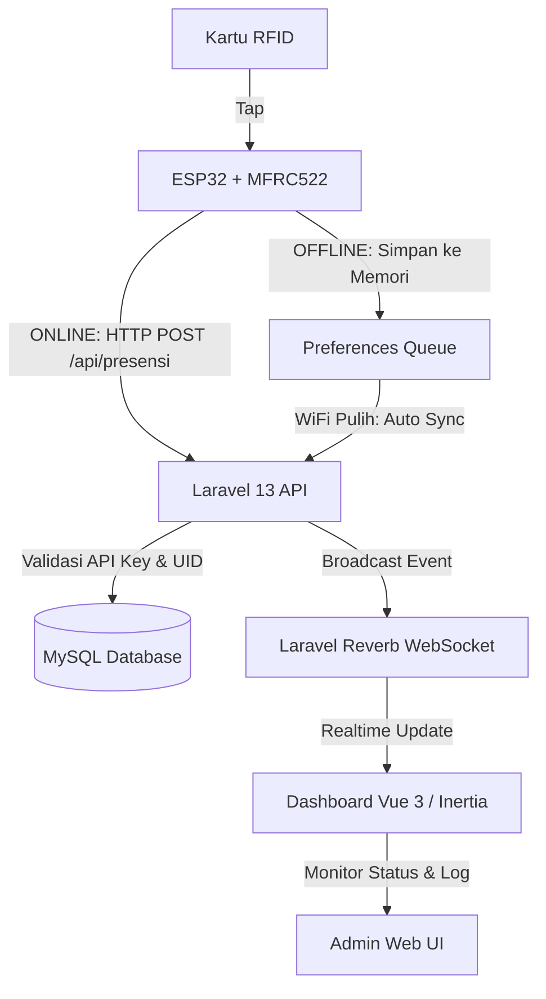

# Sistem Absensi RFID Berbasis IoT (ESP32 + Laravel + Vue + Reverb)

[](https://laravel.com)
[](https://vuejs.org)
[](https://inertiajs.com)
[](https://platformio.org)

Sistem Absensi RFID Berbasis IoT adalah solusi modern untuk mengelola presensi secara otomatis dan realtime. Sistem ini mengintegrasikan perangkat keras mikrokontroler **ESP32** dan modul pembaca RFID **MFRC522** dengan sistem web administrator berbasis **Laravel 13**, **Inertia.js v3**, **Vue 3**, dan **Laravel Reverb** sebagai server WebSocket untuk pembaruan data secara langsung (realtime) tanpa perlu memuat ulang halaman dashboard.

---

## 🚀 Fitur Utama

- 📶 **Presensi Realtime**: Data *tap* kartu dari perangkat ESP32 dikirim langsung ke server Laravel dan ditayangkan di dashboard secara realtime menggunakan Laravel Reverb & Echo.
- 💾 **Mode Offline & Antrean Offline**: Ketika koneksi WiFi terputus, ESP32 tetap dapat memproses *tap* kartu dengan menyimpan data presensi ke memori internal (`Preferences.h` / EEPROM). Data ini akan disinkronkan kembali (sync) secara otomatis begitu koneksi WiFi terhubung kembali.
- ⏰ **Penentuan Status Cerdas**: Logika absensi menentukan status `Masuk` dan `Pulang` secara dinamis berdasarkan jam kerja/shift yang sedang aktif dan riwayat presensi harian pengguna.
- 🎛️ **Manajemen Perangkat (Device Monitoring)**: Pemantauan status keaktifan (*last seen* dan *IP Address*) perangkat IoT secara langsung di web dashboard.
- 👥 **Manajemen Pengguna & Jadwal Shift**: CRUD lengkap untuk pendaftaran karyawan/siswa, penugasan UID kartu RFID, serta pengaturan jadwal kerja/shift dinamis.
- 🔊 **Indikator Fisik Perangkat**: ESP32 dilengkapi dengan indikator lampu LED dan Buzzer aktif untuk memberikan respon langsung terhadap hasil pemindaian kartu (Sukses, Kartu Baru, Gagal Validasi, atau Offline).

---

## 📐 Arsitektur Sistem



---

## 🔌 Skema Wiring (Koneksi Hardware)

### 1. Pembaca RFID MFRC522 ke ESP32
Pastikan modul MFRC522 dihubungkan ke pin SPI ESP32 dengan tegangan **3.3V** (bukan 5V untuk mencegah kerusakan modul).

| Modul MFRC522 | ESP32 GPIO | Keterangan |
| :--- | :--- | :--- |
| **SDA (SS)** | **GPIO 33** | *Slave Select* (sesuaikan konfigurasi pin) |
| **SCK** | **GPIO 18** | SPI Clock |
| **MOSI** | **GPIO 23** | SPI Master Out Slave In |
| **MISO** | **GPIO 19** | SPI Master In Slave Out |
| **RST** | **GPIO 32** | Reset Pin |
| **GND** | **GND** | Ground |
| **3.3V** | **3.3V** | Sumber Daya (3.3V) |

### 2. LED Indikator & Buzzer ke ESP32
Tambahkan resistor pengaman pada LED untuk mencegah kelebihan arus.

| Komponen | ESP32 GPIO | Keterangan |
| :--- | :--- | :--- |
| **LED Hijau (+)** | **GPIO 26** | Seri dengan Resistor 220Ω ke GND (Indikator Sukses) |
| **LED Merah (+)** | **GPIO 27** | Seri dengan Resistor 220Ω ke GND (Indikator Gagal/Offline) |
| **Buzzer (+)** | **GPIO 12** | Buzzer Aktif 3.3V - 5V |
| **GND (-)** | **GND** | Ground Bersama |

---

## 🛠️ Instalasi & Setup Sistem Web (Backend & Frontend)

### Prasyarat Sistem
- PHP >= 8.3
- Composer
- Node.js & NPM
- MySQL / MariaDB

### Langkah-Langkah Instalasi

1. **Clone Repositori**
   ```bash
   git clone https://github.com/zaenalrfn/absensiRFID.git
   cd absensiRFID
   ```

2. **Install Dependency PHP**
   ```bash
   composer install
   ```

3. **Install Dependency JavaScript**
   ```bash
   npm install
   ```

4. **Konfigurasi Environment (`.env`)**
   Salin berkas `.env.example` ke `.env` dan sesuaikan konfigurasinya:
   ```bash
   cp .env.example .env
   ```
   Atur koneksi database Anda dan parameter API Key khusus untuk perangkat ESP32:
   ```env
   DB_CONNECTION=mysql
   DB_HOST=127.0.0.1
   DB_PORT=3306
   DB_DATABASE=nama_database_anda
   DB_USERNAME=username_db_anda
   DB_PASSWORD=password_db_anda

   # Kunci API untuk otentikasi ESP32 (Gunakan string acak minimal 32 karakter)
   RFID_API_KEY=
   
   # Konfigurasi Laravel Reverb (WebSocket)
   BROADCAST_CONNECTION=reverb
   REVERB_APP_ID=my-app-id
   REVERB_APP_KEY=my-app-key
   REVERB_APP_SECRET=my-app-secret
   REVERB_HOST=127.0.0.1
   REVERB_PORT=8080
   REVERB_SCHEME=http

   VITE_REVERB_APP_KEY="${REVERB_APP_KEY}"
   VITE_REVERB_HOST="${REVERB_HOST}"
   VITE_REVERB_PORT="${REVERB_PORT}"
   VITE_REVERB_SCHEME="${VITE_REVERB_SCHEME}"
   ```

5. **Generate Application Key & Migration**
   ```bash
   php artisan key:generate
   php artisan migrate --seed
   ```
   *Catatan: Perintah `--seed` akan mengisi data dummy dasar seperti pengguna admin, contoh jadwal shift, dan beberapa data RFID default.*

6. **Menjalankan Server Web & Asset Bundling**
   Buka terminal terpisah untuk menjalankan server Laravel, bundler Vite, dan server Reverb:
   
   - Terminal 1 (Laravel Web Server):
     ```bash
     php artisan serve
     ```
   - Terminal 2 (Vite Dev Server & Compiler):
     ```bash
     npm run dev
     ```
   - Terminal 3 (Laravel Reverb WebSocket Server):
     ```bash
     php artisan reverb:start
     ```

---

## 🔌 Integrasi Perangkat IoT (Firmware ESP32)

Kode sumber firmware ESP32 dapat ditemukan di direktori `docs/ino_code.md` (atau dipisahkan ke dalam folder proyek firmware Anda). Anda dapat menggunakan **PlatformIO** (di VS Code) atau **Arduino IDE**.

### Library Pendukung (Dependencies)
Pasang library berikut melalui Library Manager:
1. `MFRC522` (oleh GithubCommunity)
2. `ArduinoJson` (oleh Benoit Blanchon)

### Konfigurasi Berkas `config.h`
Buat berkas `config.h` di sebelah berkas utama Anda, lalu sesuaikan isinya dengan kredensial jaringan Anda. **Ingat untuk tidak membagikan berkas ini atau mengunggahnya ke repositori publik.**

```cpp
#ifndef CONFIG_H
#define CONFIG_H

// Konfigurasi WiFi
const char* WIFI_SSID     = "NAMA_WIFI_ANDA";
const char* WIFI_PASSWORD = "PASSWORD_WIFI_ANDA";

// Konfigurasi Server Laravel (Ganti IP dengan IP local komputer server / domain produksi)
const char* SERVER_URL    = "http://[IP_ADDRESS]/api/presensi";
const char* PING_URL      = "http://[IP_ADDRESS]/api/ping";

// Token Autentikasi API (Wajib sama dengan nilai RFID_API_KEY di berkas .env)
const char* API_KEY       = "Bearer ----";

// Kode Unik Perangkat IoT
const char* DEVICE_CODE   = "ESP32-DEV-ROOM-A";

#endif
```

---

## 📡 API Endpoints (Untuk Integrasi Perangkat)

Semua request dari perangkat ESP32 wajib menyertakan header otentikasi:
```http
Authorization: Bearer <RFID_API_KEY_ANDA>
Content-Type: application/json
Accept: application/json
```

### 1. POST `/api/presensi`
Digunakan oleh ESP32 untuk mengirim data pemindaian kartu RFID.

- **Request Body (JSON):**
  ```json
  {
    "uid": "1A2B3C4D",
    "device_id": "ESP32-DEV-ROOM-A"
  }
  ```
- **Response Sukses (200 OK):**
  ```json
  {
    "status": "success",
    "message": "Presensi berhasil",
    "data": {
      "name": "Budi Santoso",
      "status": "masuk",
      "schedule": "Shift Pagi",
      "timestamp": "2026-05-22 08:30:15"
    }
  }
  ```
- **Response Kartu Baru Terdaftar (200 OK):**
  *(Ketika kartu RFID belum diasosiasikan dengan pengguna di database)*
  ```json
  {
    "status": "registered",
    "message": "Kartu baru terdaftar/belum di-assign ke user"
  }
  ```
- **Response Gagal Validasi (400 Bad Request):**
  ```json
  {
    "status": "error",
    "message": "Sudah absen masuk. Belum jam pulang."
  }
  ```

### 2. GET `/api/ping`
Digunakan oleh ESP32 untuk mendeteksi apakah server aktif dan terjangkau sebelum memulai proses pengiriman data antrean offline.

- **Response Sukses (200 OK):**
  ```json
  {
    "status": "ok",
    "timestamp": "2026-05-22 08:29:00"
  }
  ```

---

## 🔔 Panduan Indikator Suara (Buzzer) ESP32

Perangkat keras akan merespon dengan bunyi beep buzzer yang berbeda sesuai dengan hasil presensi:
- **1 Beep Singkat (150ms):** Presensi Berhasil (`success`).
- **2 Beep Sedang (100ms):** Kartu baru terdeteksi di database namun belum dihubungkan ke nama karyawan/pengguna (`registered`).
- **3 Beep Cepat (100ms):** Kartu tidak dikenal atau ditolak oleh sistem.
- **1 Beep Panjang (600ms):** Terjadi kesalahan jaringan / HTTP timeout / salah API Key (`error`).
- **1 Beep Sedang (250ms):** WiFi terputus, kartu disimpan ke antrean offline (`offline`).

---

## 🔒 Catatan Keamanan Penting

1. **Jaga Kerahasiaan Kredensial**: Jangan pernah mengunggah berkas `.env` atau `config.h` yang berisi password WiFi asli atau API Key produksi ke repositori Git publik. Pastikan kedua berkas tersebut terdaftar di dalam `.gitignore`.
2. **Penggunaan HTTPS**: Di lingkungan produksi, selalu gunakan protokol `HTTPS` untuk menjamin keamanan pengiriman data UID kartu RFID dari perangkat IoT ke server web agar terhindar dari serangan *man-in-the-middle* (MITM).
3. **API Rate Limiting**: Batasi jumlah percobaan request pada API untuk menghindari eksploitasi oleh perangkat luar dengan mengaktifkan middleware throttle bawaan Laravel.
